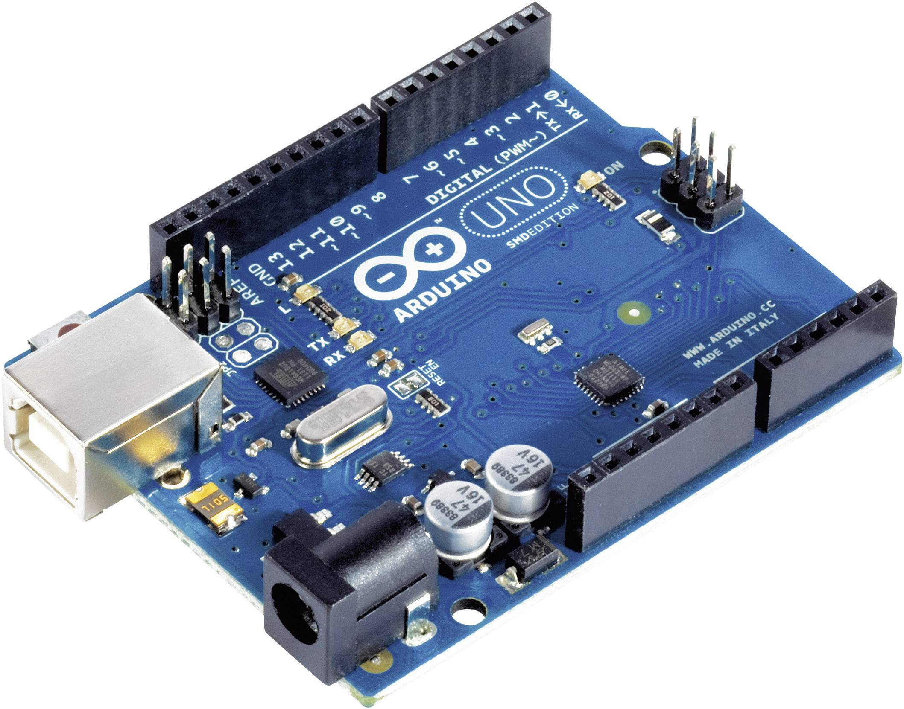
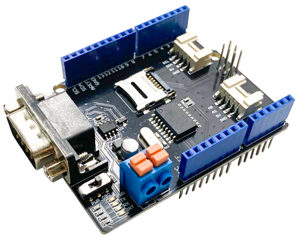
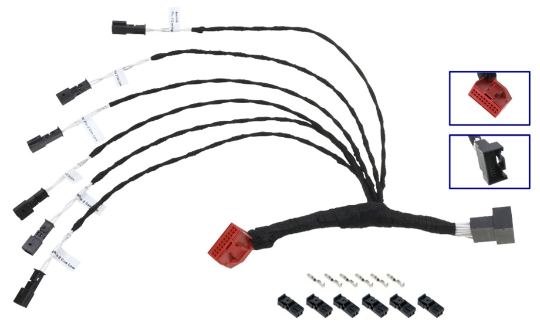
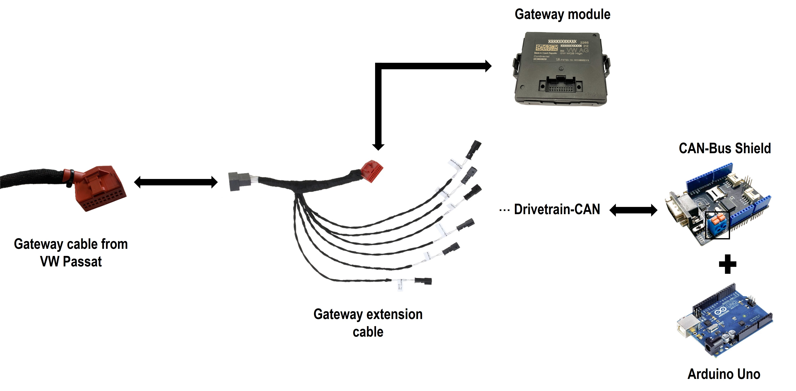

# CAN Steering Angle Reader - VW Passat

This repository describes an implementation to read the steering angle from a VW Passat in real-time using a Controller Area Network (CAN) BUS Shield interfaced with an Arduino. The code is designed to read CAN messages, specifically targeting the steering angle message, identified by its unique ID, and then extract and process the signal data from the received message.

## Introduction
Modern vehicles are typically equipped with a "Gateway" module, serving as a central hub for various Electronic Control Units (ECUs). As a result, directly accessing car signals via the OBD-II port can be restrictive. To bypass the Gateway, two primary strategies can be employed:
- Utilizing an OBD tool to send a Parameter ID (PID) request: Upon receiving the request, the Gateway interfaces with the relevant ECU to retrieve the desired data.
- Directly tapping into the CAN-Bus Network that operates "behind" the Gateway.

For research purposes, the focus will be only on observing the CAN-Bus Network situated behind the Gateway of the VW Passat.

## Hardware Overview
In this project an Arduino Uno is used as the central micocontroller to process and interpret data. The CAN-BUS Shield V2.0 and specifically its Terminal (CAN_H and CAN_L) will be used to capture real-time CAN messages. To ensure a seamless connection (without tapping/damaging the wires of the VW Passat's CAN network) a CAN-BUS Gateway Extension Cable is used, providing a reliable interface between the vehicle and our system. Below are the representations and links to each component:


| [Arduino UNO](https://store.arduino.cc/products/arduino-uno-rev3)                         | [CAN-BUS Shield V2.0](https://wiki.seeedstudio.com/CAN-BUS_Shield_V20)                 | [CAN-BUS Gateway Extension Cable](https://www.kufatec.com/de/zubehoer-ersatzteile/kabel/can-bus-gateway-adapter-plug-play-44479)            |
| ----------------------------------- | ----------------------------------- | ----------------------------------- |
|  |  |  |

## Software Dependencies

- [Arduino IDE](https://www.arduino.cc/en/software)
- [MCP_CAN Library for Arduino](https://github.com/coryjfowler/MCP_CAN_lib/tree/master)


## Setup and Installation

The installation details are as follows:

  1. Get all the required hardware components.
  2. Detach the gateway from the original cable in the VW Passat.
  3. Attach the original cable from the Passat to the black end (3D-Printed part) of the extension cable.
  4. Attach the red end of the extension cable back to the gateway module.
  5. Ensure that the car is working normally with the extension cable being placed.
  6. Identify the 6 twisted wire pairs exposed by the extension cable. Each pair corresponds to a different CAN bus (Infotainment, Convenience, Diagnostic, Extended, Comfort, Drivetrain) leading into the gateway.
  7. Locate the **Drivetrain**-CAN bus pair (explanation will follow).
  8. Interface the CAN High and CAN Low wires of the Drivetrain CAN bus with the CAN-BUS Shield.

The following image illustrates the steps:
|  |
|-|

## Usage

1. Setup the hardware and install the required software dependencies.
2. Upload the script **'src/Read_Steering_Angle_VW_Passat.ino'** to the Arduino.
3. Open the Serial Monitor in the Arduino IDE to view the captured steering angle data.

## Extracting messages and signals from DBC Files
This setup will ensure reading all the signals operating on Drivetrain Can Bus. To interpret these signals, we utilize the CAN Database (".dbc"). This file is a standardized format that defines the CAN Network communications. It contains the messages definitions and their associated signals. Each message has a unique ID, and within it, signals represent specific data parameters. For our purpose, extracting the VW Passat's steering angle, we need the ".dbc" file.

### **1. Find the DBC File**:  
  The OpenPilot Project offers an open-source github repository of vehicules ".dbc" files. The VW Passat ".dbc" file is available at: [VW Passat DBC](https://github.com/commaai/opendbc/blob/master/vw_mqb_2010.dbc).

### **2. Search for steering angle signal and identify the ID**:  
  By searching for "Lenkwinkel" (German for steering angle) in the ".dbc" file, we identify the steering angle signal and its associated message ID. The relevant message is:
  ```bash
  BO_ 134 LWI_01: 8 Gateway_MQB  
  ```
  This line defines that the message has an ID of `134`, which corresponds to `0x086` in Hex. We will be needing to filter the signals associated the ID `0x086`. For the raw steering angle, its corresponding signal is defined as follows:
  ```bash
  SG_ LWI_Lenkradwinkel: 16|13@1+ (0.1,0) [0|800] "Unit_DegreOfArc" 
  ```

### **3. Extract and process the signal**:  
   Based on the definitions in [DBC_Format_Link](http://socialledge.com/sjsu/index.php/DBC_Format), we can extract the relevant parameters of the steering angle signal:  
- Start bit position of the signal: 16  
- Length of the signal: 13 bits  
- Scaling factor: 0.1  
- Offset: 0  
- Range (Min and Max values): [0|800]  
- Unit: "Unit_DegreOfArc"  
  
Implementation details are available in **'src/Read_Steering_Angle_VW_Passat.ino'**.

## Future Work
- [ ] Extend support for other CAN signals.
- [ ] Add data processing methods.
- [ ] Implement logging mechanisms.  

## References

- [Seeed Studio](https://www.seeedstudio.com/) : CAN-BUS Shield V2.0.
- [MCP_CAN](https://github.com/coryjfowler/MCP_CAN_lib/tree/master): Library for interfacing with the MCP2515 CAN controller.
- [OpenPilot Project](https://github.com/commaai/openpilot): Open-source collection of ".dbc" files (VW Passat DBC).

## Acknowledgments
- The author; Rayen Hamlaoui would like to thank the Federal Government and the Heads of Government of the Länder, as well as the Joint Science Conference (GWK), for their funding and support within the framework of the NFDI4Ing consortium. Funded by the German Research Foundation (DFG) - project number 442146713.


